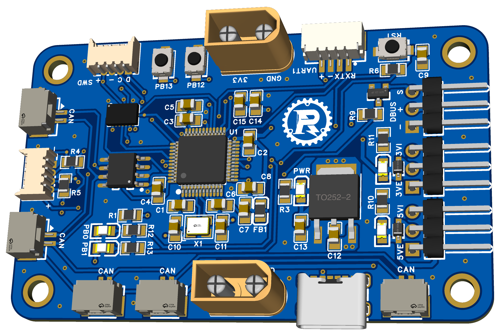

# iRM01 Development Board Firmware

Firmware for a development board supporting CAN, SPI, I2C, and UART based on a STM32F103C8T6 microcontroller. 



To get started, clone the repository and add it as an STM32CubeIDE project. 

In the workspace settings -> C/C++ General -> Paths and Symbols -> Includes, add the following include paths to the project:
```
BSP/Inc
Libraries/Inc
CMSIS-DSP/Include
```

Under the same page, add the following source locations to the project:
```
BSP/Src
Libraries/Src
Robot
CMSIS-DSP/Source
```

If you encounter this issue during compilation: `iRM01_firmware.elf section '.text' will not fit in region 'FLASH’`, go to the workspace settings -> C/C++ Build -> Settings -> MCU G++ Compiler -> Optimization and set optimization level to -Os.
